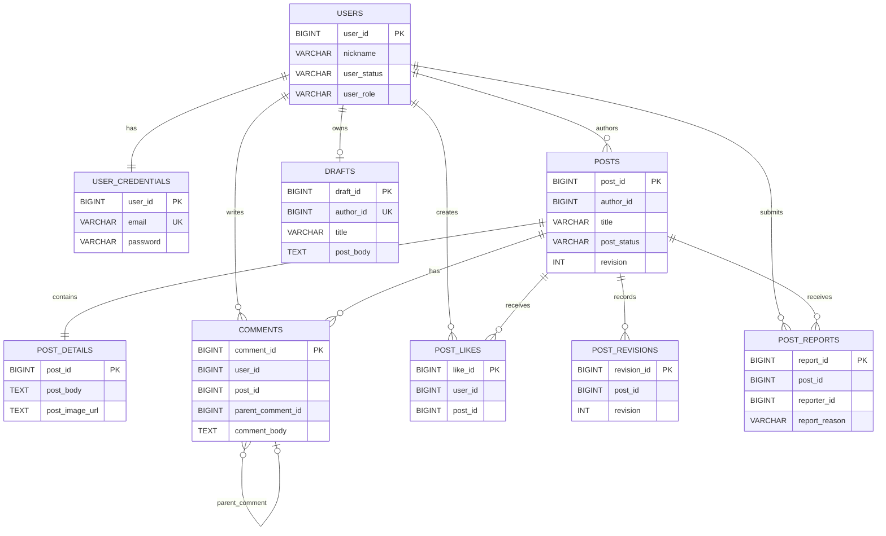

# Community Backend

커뮤니티 서비스의 REST API를 제공하는 Spring Boot 백엔드입니다. `com.example.community`를 루트 패키지로 사용하며, 회원·게시글·댓글 도메인과 JWT 인증, Redis 세션 검증, SSE 알림을 담당합니다.

## 주요 기능

- 회원가입, 로그인, 토큰 재발급, 로그아웃, 회원정보·비밀번호 수정, 회원 탈퇴
- 게시글 작성·조회·수정·삭제, 20개 단위 목록 페이지네이션
- 임시저장글 조회·저장·수정·발행·삭제
- 댓글·대댓글 작성, 조회, 수정, 삭제
- 게시글 좋아요, 신고, 신고 누적에 따른 블라인드
- 역할 기반 관리자 API
- 새 게시글·댓글 SSE 알림, 중복 로그인 감지와 이전 세션 종료

## 기술 스택

- Java, Spring Boot
- MariaDB, H2, Redis
- JWT (`jjwt`), SSE (`SseEmitter`)
- Docker, GitHub Actions, AWS ECR·EC2·Systems Manager

## Entity Relationship Diagram (ERD)



## 패키지와 책임 구조

- `auth`: 로그인·refresh·logout 및 JWT/Refresh Session 처리
- `user`: 회원가입, 회원정보·비밀번호 수정, 회원 탈퇴
- `post`: 게시글, 좋아요, 신고·블라인드
- `post/draft`: 임시저장글과 발행
- `comment`: 댓글·대댓글
- `realtime`: SSE 연결 registry, 관심 화면, 이벤트 전송
- `global`: `ApiResponse<T>`, 보안 설정·JWT filter, 공통 예외·DTO·mapper
- `CommunityApplication`: Spring Boot 진입점과 scheduling 활성화

응답은 공통 `ApiResponse<T>`의 `message`, `data` 필드를 사용합니다.

## API

```text
/api/auth       로그인, 재발급, 로그아웃
/api/users      회원가입, 회원정보 수정, 비밀번호 변경, 탈퇴
/api/posts      게시글, 좋아요, 신고
/api/draft-post 임시저장
/api/posts/{postId}/comments
/api/realtime   SSE 연결과 관심 화면 변경
```

## 인증·세션

- Access Token은 Bearer Token으로 전달
- Refresh Token은 HttpOnly Cookie로 전달
- Redis에 사용자별 단일 Refresh Session 저장
- Refresh Token Rotation 적용
- Redis Lua Script로 세션 교체·Rotation·조건부 삭제를 원자적으로 처리
- Access Token의 `sessionId`와 Redis의 현재 세션 비교
- 다른 환경에서 로그인하면 기존 세션에 `session-replaced` SSE 이벤트 전송
- 로그아웃·탈퇴 시 Redis 세션과 관련 SSE 연결 종료

## 실시간 알림

클라이언트별 SSE 연결과 현재 관심 화면을 메모리 Registry로 관리합니다.

- 게시글 목록: 새 게시글 알림
- 게시글 상세: 새 댓글 알림
- 이벤트는 트랜잭션 커밋 이후 전송
- payload는 식별자만 전달
- 클라이언트가 알림을 확인하면 기존 REST API로 데이터를 다시 조회


## 데이터 조회·성능 개선

- 게시글 목록 20개 단위 pagination
- `createdAt DESC, postId DESC` 정렬
- 대용량 변환 데이터셋을 H2·MariaDB에 적재해 조회 성능 측정
- `JOIN`, `LEFT JOIN`, 복합 인덱스 조합 비교
- MariaDB `EXPLAIN`으로 실행계획 확인
- HTTP 시간, Service Repository 시간, 순수 SQL 시간을 분리해 측정

## Docker/AWS/Github Actions를 통한 배포

1. GitHub Actions에서 Gradle build와 테스트 실행
2. Docker 멀티스테이지 이미지 생성
3. GitHub OIDC로 AWS 인증
4. 이미지를 Amazon ECR에 업로드
5. Systems Manager로 EC2 배포 명령 실행

## 회고
커뮤니티 성격의 웹 어플리케이션을 제작해보면서 다른 커뮤니티 서비스들에서 사용되는 기능들을 생각해보며 SSE 같은 기술을 사용해보는 것에 목적을 두었습니다. 특히 많은 양의 게시글과 댓글이 하루에도 추가되는 커뮤니티 사이트의 특성을 고려해 데이터 40만건의 게시글을 추가하고, 60만건의 댓글 데이터를 추가하며 그 안에서 목록 조회시 성능 저하를 발견하고, 이를 해결하기 위한 인덱싱, 쿼리 최적화를 진행해볼 수 있었습니다.

기간 내 여러 사용자가 동시에 접속해 서비스를 사용하는 등의 상황을 시험해보지 못한 것과 무중단 배포를 진행하지 못한 것이 아쉽지만, 추후 개인적으로 진행해보고 모니터링 해 볼 생각입니다. 

## 관련 저장소

- Frontend: `https://github.com/100-hours-a-week/KTB4_luna_FE`